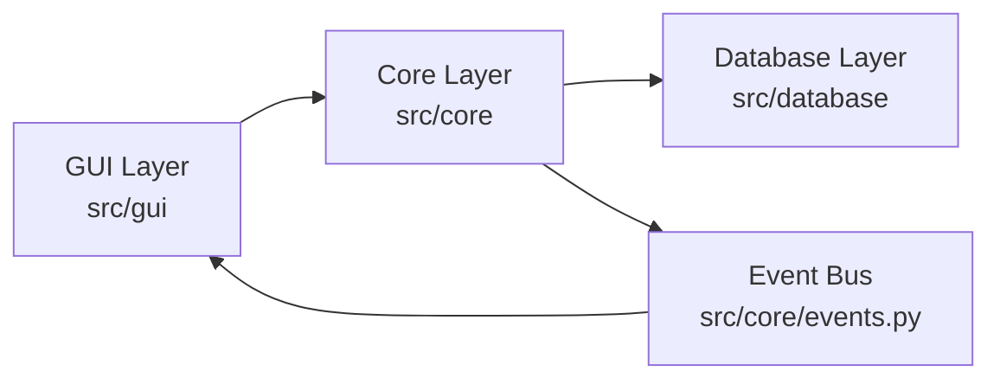

# CryptoSafe Manager

CryptoSafe Manager — это безопасный менеджер паролей с локальной зашифрованной базой данных (SQLite), реализованный на Python + Tkinter.  

Проект разрабатывается в рамках учебного курса и состоит из 8 последовательных спринтов, каждый из которых добавляет новые функции безопасности и удобства.

Основная цель — создать безопасное локальное хранилище,
защищённое мастер-паролем и криптографией.

#  План разработки (8 спринтов)

##  Спринт 1 — Архитектура и основа
- Структура проекта
- SQLite база данных
- EventBus
- Заглушка шифрования (XOR placeholder)
- GUI (Tkinter)
- Setup Window (создание мастер-пароля)
- README + архитектурная документация

##  Спринт 2 — Аутентификация и управление ключами
- Master password hashing (salt + PBKDF2)
- Key derivation
- Session management
- Login window
- Хранение auth_hash в key_store

##  Спринт 3 — Шифрование
- Замена XOR на AES
- Secure memory handling
- Key rotation support

##  Спринт 4 — Безопасное хранилище
- Шифрование записей в БД
- Разделение metadata и encrypted payload

##  Спринт 5 — Продвинутая безопасность
- Brute-force protection
- Exponential backoff
- Audit improvements

##  Спринт 6 — Пользовательский опыт и улучшения
- Автоблокировка
- Clipboard timeout
- Password strength checker

##  Спринт 7 — Тестирование и укрепление
- Unit tests coverage
- Edge-case testing
- Code cleanup

##  Спринт 8 — Финальный обзор безопасности
- Threat modeling
- Security checklist
- Documentation finalization

# Инструкция по установке

## Клонирование репозитория

```bash
git clone <your-repository-url>
cd Cryptosafe-manager
```
## Создайте и активируйте виртуальное окружение

```bash
# Windows
python -m venv venv
venv\Scripts\activate

# Linux / macOS
python3 -m venv venv
source venv/bin/activate
```

## Установите зависимости
```bash
pip install -r requirements.txt
```

## Запустите приложение
```bash
python src/gui/main_window.py
```
# Архитектура проекта (MVC-подобная)


